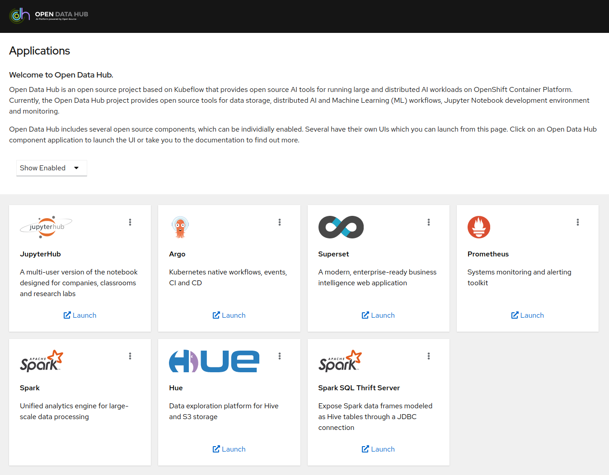

# Open Data Hub on MOC

This repository contains all the operational and user documentation for running the Open Data Hub in MOC.

## Getting Started

We have [Open Data Hub](https://opendatahub.io/) applications deployed and running in a MOC ([Mass Open Cloud](https://massopen.cloud/)) cluster.

The ODH homepage on MOC can be found at [ODH Dashboard](https://odh-dashboard-opf-dashboard.apps.cnv.massopen.cloud/). From there you can access any of the provided application:

https://odh-dashboard-opf-dashboard.apps.cnv.massopen.cloud/

## Component status

| Component               | Availability      | Authentication (see below)                                                         |
| ----------------------- | ----------------- | ---------------------------------------------------------------------------------- |
| AI-Library              | ❌ (Not deployed) |                                                                                    |
| Airflow                 | ❌ (Not deployed) |                                                                                    |
| Argo                    | ✔️                | None (Login via OpenShift [WIP](https://github.com/operate-first/odh/issues/39))   |
| Grafana                 | ✔️                | Custom (Login via OpenShift [WIP](https://github.com/operate-first/odh/issues/37)) |
| Hue                     | ✔️                | user:`generic_user` pass:`redhat` (Login via OpenShift [WIP](https://github.com/operate-first/odh/issues/47)) |
| JupyterHub              | ✔️                | Login via OpenShift                                                                |
| Kafka                   | ✔️ (Stabilizing)  |                                                                                    |
| ODH Dashboard           | ✔️                | None                                                                               |
| Prometheus              | ✔️                | None                                                                               |
| Seldon                  | ❌ (Not deployed) |                                                                                    |
| Spark                   | ✔️                | None                                                                               |
| Spark SQL Thrift Server | ✔️                | None                                                                               |
| Superset                | ✔️                | user:`generic_user` pass:`redhat` (Login via OpenShift [WIP](https://github.com/operate-first/odh/issues/48)) |

### Authenticate via OpenShift

We aim to support authentication via the underlying OpenShift platform for all the components.

Each supported component provides a login button which states "Login via OpenShift" or "Sign in with OpenShift". This will lead you to authentication provider selection screen:

Please select `moc-sso` provider. Then choose the final account provider that fits you the most:

## End User Support

If you have any problems, questions and feature requests please report them by opening an issue in this repo [here](https://github.com/operate-first/odh-moc-support/issues) and we will be happy to assist!

## Community

- Website: https://operate-first.github.io/operate-first/
- Google Chat Room: https://chat.google.com/room/AAAAAYpDdc8
