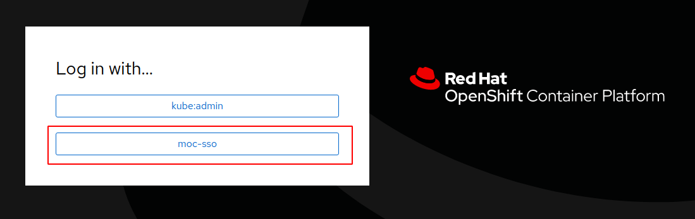
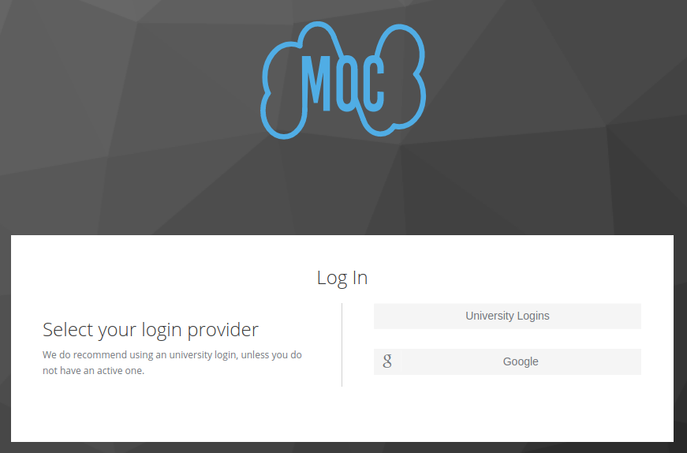

# Onboarding to a cluster

This document serves as a guide for adding cluster scoped resources of `Namespace` and `Group` kinds. Following steps in this guide should result in a PR against the [operate-first/apps](https://github.com/operate-first/apps) repository.

Currently we support 2 ways to request/perform onboarding to any supported clusters:

1. Onboarding request - please use the **Onboarding to Cluster** issue template in [operate-first/support](https://github.com/operate-first/support) repository.
2. Opening a PR with the desired changes. The rest of this doc focuses on this second option. We'd gladly welcome your contributions.

## Prerequisites

You will need pre-requisite tools to follow along with this doc, please do one of the following:

- Install our [toolbox](https://github.com/operate-first/toolbox) to have the developer setup ready automatically for you.
- Install the tools manually. You'll need [kustomize](https://kustomize.io/), [sops](https://github.com/mozilla/sops) and [ksops](https://github.com/viaduct-ai/kustomize-sops).

Please fork/clone the [operate-first/apps](https://github.com/operate-first/apps) repository. **During this whole setup, we'll be working within this repository.**

For successful completion of this guide you need to understand what the aim is. Please have prepared following data:

- Name of the onboarded team.
- Desired namespace name. Please use your team name as a prefix. This will make it easier for you to [onboard to ArgoCD](https://github.com/operate-first/argocd-apps/blob/main/docs/onboard_team_to_argocd.md) later on.
- List of users you'd like to add to your team.
- An optional team GPG key, in case you would like to modify the encrypted list of users of your team later on.

## Recipe

If you want to know more about the overall design please consult the ADR documentation at [operate-first/support](https://github.com/operate-first/blueprint).

In general we store all the cluster-scoped resources in a `cluster-scope` kustomize application within this repository.

## Adding namespaces

For easier [onboard to ArgoCD](https://github.com/operate-first/argocd-apps/blob/main/docs/onboard_team_to_argocd.md) later on, we prefer to follow a name pattern for all our namespaces. Please use your team name as a prefix to the namespace name like so: `$OWNER_TEAM-example-project`.

### Base resources

Please run:

```sh
bash scripts/onboarding.sh NAMESPACE_NAME OWNER_TEAM OPTIONAL_PROJECT_DESCRIPTION
```

This script will create

- A namespace in `cluster-scope/base/namespaces/$NAMESPACE_NAME`
- A blank user group for the `$OWNER_TEAM` if it does not exist yet in the `cluster-scope/base/groups/$OWNER_TEAM`
- An RBAC component for the project admin role `RoleBinding` in `cluster-scope/components/namespace-admin-rolebinding/$OWNER_TEAM` and maps it to the newly added namespace.

### Enabling namespace deployment to a specific cluster

```sh
cd cluster-scope/overlays/TARGET_CLUSTER
kustomize edit add resource ../../base/namespaces/$NAMESPACE
```

### Authenticate via OpenShift
Each supported component provides a login button which states "Login via OpenShift" or "Sign in with OpenShift". This will lead the user to an authentication provider selection screen:



Please select `moc-sso` provider. Then choose the final account provider that fits you the most:



## Giving Users Rbac Permissions

The following steps enable users to access designated cluster/namespaces. This simply consists of adding such users to the appropriate OpenShift groups with access to those cluster/namespaces. Depending on the cluster, these groups may need to be encrypted, or may be stored as plaintext, each scenario requires a different set of steps.

To recognise which scenario applies to you, please select target cluster in `cluster-scope/overlays/TARGET_CLUSTER`. You either see a `secret-generator.yaml` (encrypted users) file or `group-user_patch.yaml` file (plaintext) in this folder.

Please follow the steps according to your use case:

- [Creating a group or adding users as an encrypted resource](#encrypted-overlay-patch-for-users)
- [Creating a group or adding users without encryption](#plaintext-overlay-patch-for-users)

### Encrypted overlay patch for users

We'll use sops/ksops for the encryption in here.

Please change your working directory to `cluster-scope/overlays/TARGET_CLUSTER`.

#### Creating new group encrypted overlay patch

Please create following resource describing the users in your group:

```yaml
# groups/GROUP_NAME.yaml
apiVersion: user.openshift.io/v1
kind: Group
metadata:
  name: GROUP_NAME
  annotations:
    kustomize.config.k8s.io/behavior: replace
users:
  - USER_1
  - USER_2
```

Now please encrypt the file with sops and verify it contains a fingerprint of both GPG keys: the OperateFirst master key and your team's key.

```sh
$ sops --encrypt --encrypted-regex="^users$" --pgp="0508677DD04952D06A943D5B4DC4116D360E3276, YOUR_GPG_KEY_FINGERPRINT" groups/GROUP_NAME.yaml > groups/GROUP_NAME.enc.yaml
$ grep "fp: " groups/GROUP_NAME.enc.yaml
        fp: 0508677DD04952D06A943D5B4DC4116D360E3276
        fp: YOUR_GPG_KEY_FINGERPRINT

```

Explanation to the `sops` command:

- `encrypt` flag encrypts a resource
- `encrypted-regex` value maps to the XPath-like regex to specifies which parts of the file should be encrypted. The rest of the file is left as a plaintext for easier management. In this case we want to encrypt only the `users` property in the file. See the docs [here](https://github.com/mozilla/sops#encrypting-only-parts-of-a-file).
- `pgp` list all the GPG keys which will be used to encrypt this file.

Don't forget to remove the plaintext variant of the resource before staging for a commit:

```sh
rm groups/GROUP_NAME.yaml
```

And list the sops encrypted file in the secret generator file:

```yaml
# secret-generator.yaml
files:
---
- groups/GROUP_NAME.enc.yaml
```

#### Adding user to encrypted overlay patch

Use sops to edit the encrypted group resource patch as:

```sh
sops groups/GROUP_NAME.enc.yaml
```

Then simply append the list of users with the new users that need to be added.

### Plaintext overlay patch for users

This is expected to be a simple JSON kustomize patch.

Please change your working directory to `cluster-scope/overlays/TARGET_CLUSTER`.

#### Creating new group plaintext overlay patch

Create a file containing a JSON patch that looks like this:

```yaml
# group-user_patch.yaml
- op: add
  path: /users/-
  value: USER_1
- op: add
  path: /users/-
  value: USER_2
```

And list it as a patch for groups you desire to patch:

```yaml
# kustomization.yaml
patchesJson6902:
  ...
  - path: group-user_patch.yaml
    target:
      group: user.openshift.io
      kind: Group
      name: GROUP_NAME
      version: v1
```

#### Adding users to plaintext overlay patch

This is very similar to the previous section. Just edit the patch file and add new users to the group patch and verify this file propagates to the appropriate groups in the `kustomization.yaml`.

## Finalize

Please stage your changes and send them as a PR against the [operate-first/apps](https://github.com/operate-first/apps) repository. Make sure:

- Change set includes only you modifications within the `cluster-scope` application.
- Change set may include your optional changes to the `.sops.yaml` file.
- Your commit **doesn't include any sensitive data as an unencrypted resource**, such resources should be included only as encrypted.
